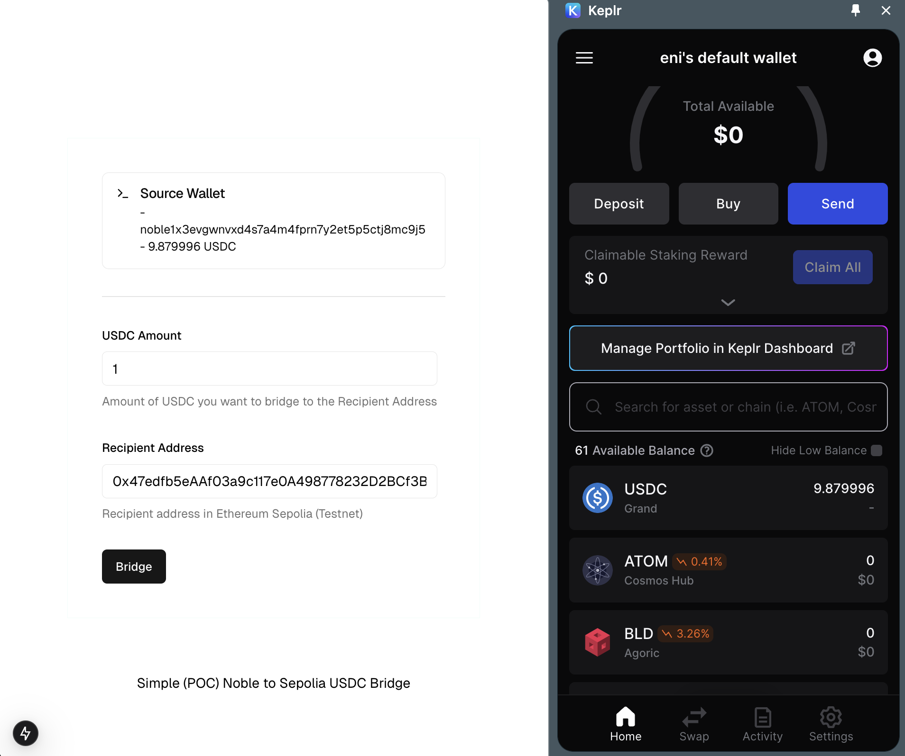
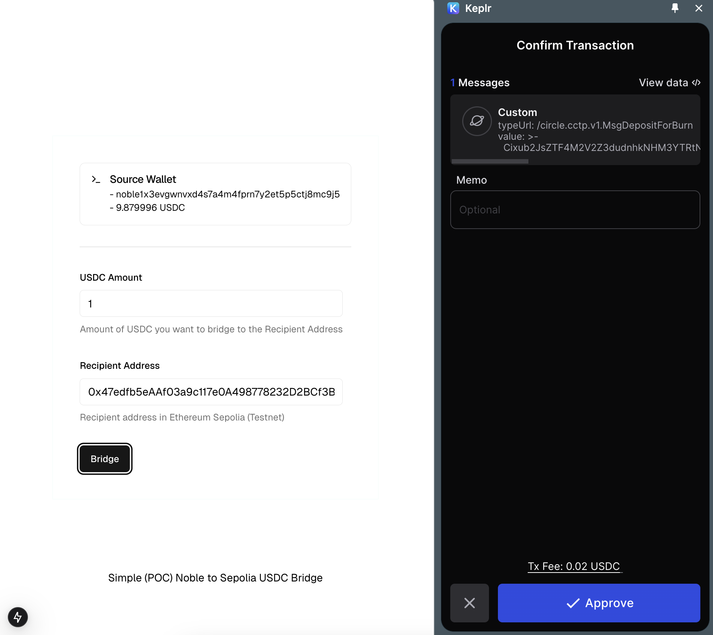
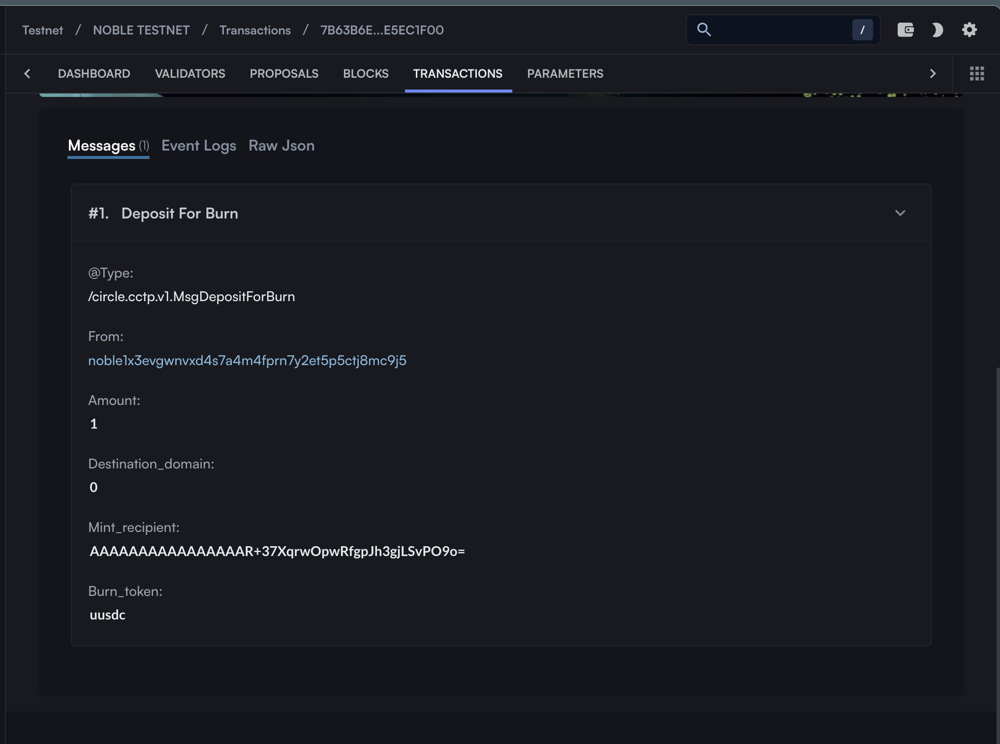
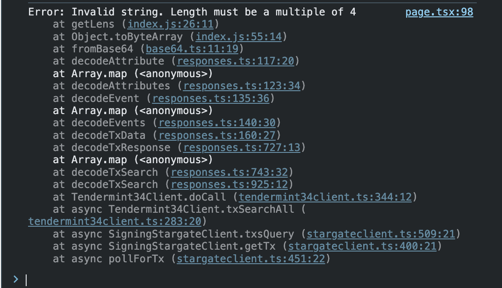
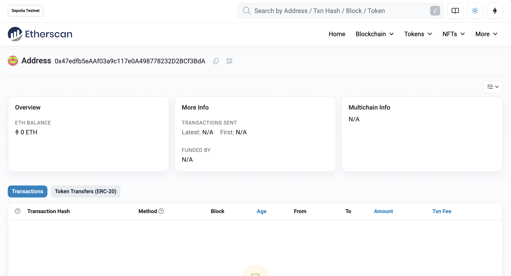

```
/!\ The updated version of this repo is found here:
https://github.com/enibundo/usd-bridge-2
```
### Description
This is a simple app that bridges USDC from Noble Testnet to Ethereum Sepolia. Here you can learn how to interact with noble chain, using cosmjs, connecting to keplr wallet (browser extension) as well as the CCTP (cross chain transfer protocol).

According to

- https://developers.circle.com/stablecoins/transfer-usdc-on-testnet-from-noble-to-ethereum
- https://github.com/circlefin/noble-cctp/tree/master/examples

It is described that there is a CCTP (cross chain transfer protocol) put in place with a relayer doing the automatic burn/mint mechanics of the bridge if instructed properly.

With this in place we'd have to code :

1. Dapp that connects to kepler (React UI)
2. Broadcasting the burn transaction using the signer of kepler wallet

Libraries used: cosmjs, react, kepler, tailwind, etc.

### Screenshots

Here the dapp is connected to the kepler wallet (in the right) and shows its current USDC balance.



---

Here the bridge transactions needs approal through the kepler extensions



---

Here is the transaction on mintscan of noble testnet
https://www.mintscan.io/noble-testnet/tx/7B63B6E45AB0F751C663AE16D64B5E936C02EEF58CDFB606B90D46FEE5EC1F00?sector=json



When this transaction is pushed, the response from the RPC node (https://rpc.testcosmos.directory/nobletestnet) is not parsed correctly.



According to

- https://github.com/cosmos/cosmos-sdk/issues/11997
- https://github.com/b9lab/cosmjs-sandbox/pull/2

There might be some issues or unmaintained libraries

---

If we see in sepolia https://sepolia.etherscan.io/address/0x47edfb5eAAf03a9c117e0A498778232D2BCf3BdA

We can't see a mint transaction.



I am not sure (yet) to why there isn't a mint transaction as the USDC relayer (CCTP) should have done this, unless there isn't one deplpoyed and I need to deploy it myself (this wasn't stated in the tutorial).
_This is a place for improvement._
